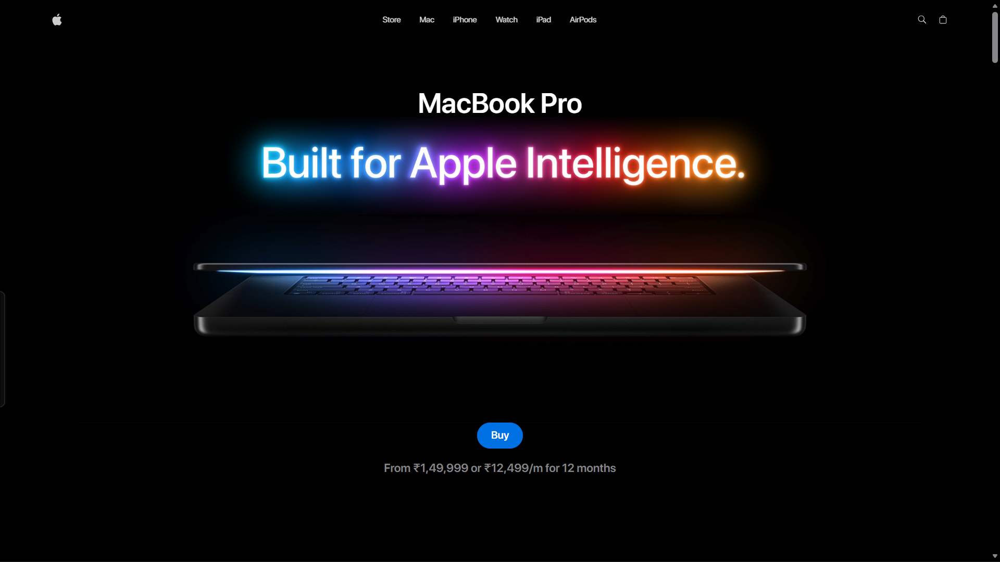

# MacBook 3D Landing Page (GSAP + Three.js)


[](https://react.dev/)
[](https://tailwindcss.com/)
[](https://threejs.org/)
[](https://greensock.com/gsap/)
[](https://vitejs.dev/)
[](https://github.com/pmndrs/zustand)
[](https://github.com/contra/react-responsive)


## 📖 Table of Contents

*   [Features](#-features)
*   [Tech Stack](#-tech-stack)
*   [Installation](#-installation)
*   [Folder Structure](#-folder-structure)
*   [Usage](#-usage)
*   [Deployment (Vercel)](#-deployment-vercel)
*   [Performance Notes](#-performance-notes)
*   [Best Practices](#-best-practices)
*   [Contribution Guidelines](#-contribution-guidelines)
*   [Troubleshooting](#-troubleshooting)
*   [Acknowledgements](#-acknowledgements)
*   [Contact](#-contact)

## Demo Screenshot




## Demo Link: [Go live](https://applelike.vercel.app/)

## 📝 Description

This project is a sophisticated clone of the Apple website, focusing on delivering an immersive and interactive user experience through advanced 3D graphics and fluid animations. Built with modern web technologies, it demonstrates how to integrate complex 3D models, create engaging scroll-based and interactive animations, and ensure a responsive design across various devices. It serves as a showcase for high-performance web development, particularly in the realm of 3D product visualization.

## ✨ Features

*   **Interactive 3D Product Viewer:** Seamlessly load and interact with high-fidelity 3D models of Apple products (e.g., MacBooks) directly within the browser, allowing for rotation, zooming, and detailed inspection.
*   **Cinematic Scroll Animations:** Experience captivating, scroll-triggered animations powered by GSAP, bringing product narratives to life with smooth transitions and dynamic visual effects.
*   **Responsive & Adaptive Design:** A meticulously crafted user interface that adapts flawlessly to desktops, tablets, and mobile devices, ensuring an optimal viewing experience for all users.
*   **Modular Component Architecture:** Developed using React's component-based paradigm, promoting reusability, maintainability, and scalability of the codebase.
*   **High-Performance Media Integration:** Efficient handling and playback of product videos and high-resolution images to enhance the visual storytelling without compromising load times.
*   **State-of-the-Art State Management:** Utilizes Zustand for a lightweight and efficient global state management solution, ensuring predictable data flow throughout the application.

## 🚀 Tech Stack

*   **Frontend:**
    *   [React 19](https://react.dev/) - A declarative, component-based JavaScript library for building user interfaces.
    *   [Vite](https://vitejs.dev/) - A next-generation frontend tooling that provides an incredibly fast development experience.
    *   [Tailwind CSS](https://tailwindcss.com/) - A utility-first CSS framework for rapidly building custom designs.
    *   [GSAP (GreenSock Animation Platform)](https://greensock.com/gsap/) - The industry-standard JavaScript animation library for the modern web.
    *   [Three.js](https://threejs.org/) - A powerful 3D library for rendering interactive graphics in the browser.
    *   [React Three Fiber](https://docs.pmnd.rs/react-three-fiber/getting-started/introduction) - A React renderer for Three.js, allowing you to build 3D scenes with React components.
    *   [Drei](https://docs.pmnd.rs/drei/introduction) - A collection of useful helpers and abstractions for React Three Fiber.
    *   [Zustand](https://zustand-demo.pmnd.rs/) - A small, fast, and scalable bearbones state-management solution.
    *   [React Responsive](https://github.com/yocontra/react-responsive) - Media queries in React for responsive component rendering.
*   **Code Quality:**
    *   [ESLint](https://eslint.org/) - Pluggable JavaScript linter.

## 📦 Installation

To get a local copy of this project up and running, follow these steps.

### Prerequisites

Ensure you have the following installed on your system:

*   [Node.js](https://nodejs.org/en/) (LTS version recommended, e.g., v18.x or v20.x)
*   [npm](https://www.npmjs.com/) (comes with Node.js) 

### Steps

1.  **Clone the repository:**
    ```bash
    git clone https://github.com/saksham2882/gsap-macbook-landing-page.git
    cd gsap-macbook-landing-page
    ```

2.  **Install dependencies:**
    ```bash
    npm install
    ```

3.  **Start the development server:**
    ```bash
    npm run dev
    ```
    The application will typically be accessible at `http://localhost:5173`. Vite will inform you of the exact address.

4.  **Build for production:**
    ```bash
    npm run build
    ```
    This command compiles the project into the `dist` directory, ready for deployment.


## 📂 Folder Structure

```
.
├── public/                      # Static assets served directly (images, videos, 3D models, fonts)
│   ├── ai.png                   # Example image
│   ├── battery.png              # Example image
│   ├── cart.svg                 # SVG icon
│   ├── ...                      # Other images and icons
│   ├── fonts/                   # Custom fonts
│   ├── models/                  # GLB 3D models (e.g., macbook.glb, macbook-14.glb)
│   └── videos/                  # MP4 video assets (e.g., hero.mp4, feature-1.mp4)
├── src/                         # Main application source code
│   ├── App.jsx                  # Root React component, orchestrates main layout and routes
│   ├── index.css                # Global CSS styles, typically includes Tailwind directives
│   ├── main.jsx                 # Entry point for the React application (ReactDOM.createRoot)
│   ├── components/              # Reusable UI components and feature-specific sections
│   │   ├── Features.jsx         # Component for displaying product features
│   │   ├── Footer.jsx           # Application footer
│   │   ├── Hero.jsx             # Hero section with main product display
│   │   ├── Highlights.jsx       # Section for key highlights
│   │   ├── NavBar.jsx           # Navigation bar
│   │   ├── Performance.jsx      # Section detailing performance aspects
│   │   ├── ProductViewer.jsx    # Component for interactive 3D product viewing
│   │   ├── Showcase.jsx         # Product showcase section
│   │   └── models/              # Specific 3D model components (e.g., Macbook.jsx)
│   │   └── threejs/             # Three.js related utilities and components
│   │       ├── ModelSwitcher.jsx # Logic for switching between 3D models
│   │       └── StudioLights.jsx  # 3D scene lighting setup
│   ├── constants/               # Global constants and configuration values
│   │   └── index.js             # Example: API endpoints, magic numbers
│   └── Store/                   # Zustand store for global state management
│       └── index.js             # Centralized state definitions and actions
├── .gitignore                   # Specifies intentionally untracked files to ignore
├── eslint.config.js             # ESLint configuration for code linting
├── index.html                   # Main HTML file, entry point for the web browser
├── package-lock.json            # Records the exact dependency tree
├── package.json                 # Project metadata, scripts, and dependencies
├── README.md                    # Project README file (this file)
└── vite.config.js               # Vite build tool configuration
```

## 💡 Usage

Once the development server is running, open your web browser and navigate to the provided local address (e.g., `http://localhost:5173`).

*   **Explore the 3D Models:** Interact with the 3D models by clicking and dragging to rotate them. Use scroll or pinch gestures to zoom in and out.
*   **Experience Animations:** Scroll through the different sections of the website to trigger various cinematic animations and transitions.
*   **Responsive Interaction:** Test the website on different screen sizes to observe its adaptive layout and responsive behaviors.

## 🌐 Deployment (Vercel)

This project is optimized for deployment on platforms like Vercel due to its static build output.

1.  **Build the project:**
    ```bash
    npm run build
    ```
    This will generate a `dist` folder.

2.  **Deploy to Vercel:**
    *   **Via Vercel CLI:**
        ```bash
        npm install -g vercel
        vercel deploy dist
        ```
        Follow the prompts to link your project and deploy.
    *   **Via Git Integration:**
        1.  Push your project to a Git repository (GitHub, GitLab, Bitbucket).
        2.  Go to [Vercel Dashboard](https://vercel.com/dashboard).
        3.  Click "Add New..." -> "Project".
        4.  Import your Git repository.
        5.  Vercel will automatically detect it's a Vite project and configure the build settings (`npm run build`) and output directory (`dist`).
        6.  Click "Deploy".

## ⚡ Performance Notes

Optimizing performance is crucial for 3D-heavy web applications. Here are some considerations and practices applied (or recommended):

*   **3D Model Optimization:** Ensure `.glb` models are compressed and optimized for web use (e.g., reduced polygon count, efficient textures). Tools like `gltf-pipeline` can be helpful.
*   **Lazy Loading:** Implement lazy loading for components, images, and especially 3D models that are not immediately visible to reduce initial load times.
*   **Animation Efficiency:** GSAP is highly optimized, but ensure animations are not over-complex or running on elements that cause expensive reflows. Use `will-change` CSS property where appropriate.
*   **Resource Caching:** Leverage browser caching for static assets (images, videos, models) to improve performance on repeat visits.
*   **Bundle Analysis:** Use tools like `rollup-plugin-visualizer` (for Vite) to analyze your JavaScript bundle size and identify areas for optimization.
*   **Debouncing/Throttling:** Apply debouncing or throttling to event listeners (e.g., scroll, resize) to prevent excessive function calls.

## ✅ Best Practices

*   **Component-Driven Development:** Maintain a clear separation of concerns with well-defined React components.
*   **Consistent Styling:** Adhere to Tailwind CSS conventions for styling, utilizing its utility classes and custom configurations.
*   **Accessibility (A11y):** Ensure all interactive elements are accessible via keyboard and screen readers. Add appropriate ARIA attributes.
*   **Code Linting:** Use ESLint to enforce code style and catch potential errors early in the development cycle.
*   **Version Control:** Commit frequently with descriptive messages. Use branches for features and bug fixes.
*   **State Management:** Use Zustand effectively for global state, keeping component state local where possible.
*   **Error Boundaries:** Implement React Error Boundaries to gracefully handle errors in component trees.

## 🤝 Contribution Guidelines

We welcome contributions to this project! To contribute, please follow these steps:

1.  **Fork the repository.**
2.  **Clone your forked repository:**
    ```bash
    git clone https://github.com/<your-username>/gsap-macbook-landing-page.git
    ```
3.  **Create a new branch** for your feature or bug fix:
    ```bash
    git checkout -b feature/your-feature-name
    # or
    git checkout -b bugfix/issue-description
    ```
4.  **Make your changes.** Ensure your code adheres to the project's coding style and best practices.
5.  **Test your changes** thoroughly.
6.  **Commit your changes** with a clear and concise message:
    ```bash
    git commit -m "feat: Add new feature X"
    # or
    git commit -m "fix: Resolve issue Y"
    ```
7.  **Push your branch** to your forked repository:
    ```bash
    git push origin feature/your-feature-name
    ```
8.  **Open a Pull Request** to the `main` branch of the original repository. Provide a detailed description of your changes.


## ❓ Troubleshooting

*   **`npm install` fails:**
    *   Ensure Node.js and npm/yarn are correctly installed and up-to-date.
    *   Clear npm cache: `npm cache clean --force` then `npm install`.
    *   Delete `node_modules` and `package-lock.json` (or `yarn.lock`) and try `npm install` again.
*   **3D models not loading:**
    *   Check the console for Three.js or React Three Fiber errors.
    *   Verify the paths to your `.glb` files in `public/models/`.
    *   Ensure your `ModelViewer` or equivalent component is correctly configured.
*   **Animations not working:**
    *   Check for GSAP-related errors in the console.
    *   Ensure GSAP and ScrollTrigger (if used) are correctly imported and initialized.
    *   Verify CSS properties are not overriding GSAP animations.
*   **Tailwind CSS not applying styles:**
    *   Ensure `tailwind.config.js` is correctly configured to scan your files.
    *   Check `index.css` for the correct Tailwind directives (`@tailwind base;`, etc.).
    *   Rebuild the project or restart the development server.


## 🙏 Acknowledgements

*   Inspired by Apple's official website design and interactive elements.
*   Thanks to the creators and maintainers of React, Vite, Three.js, GSAP, Tailwind CSS, and all other open-source libraries used in this project.
*   Special thanks to the online communities and tutorials that provide invaluable knowledge and support.

## 📧 Contact

If you have any questions, suggestions, or just want to connect:

*   **GitHub:** [@saksham2882](https://github.com/saksham2882)
*   **Portfolio:** [saksham-agrahari](https://saksham-agrahari.vercel.app/)
*   **LinkedIn:** [@saksham-agrahari](https://www.linkedin.com/in/saksham-agrahari/)
